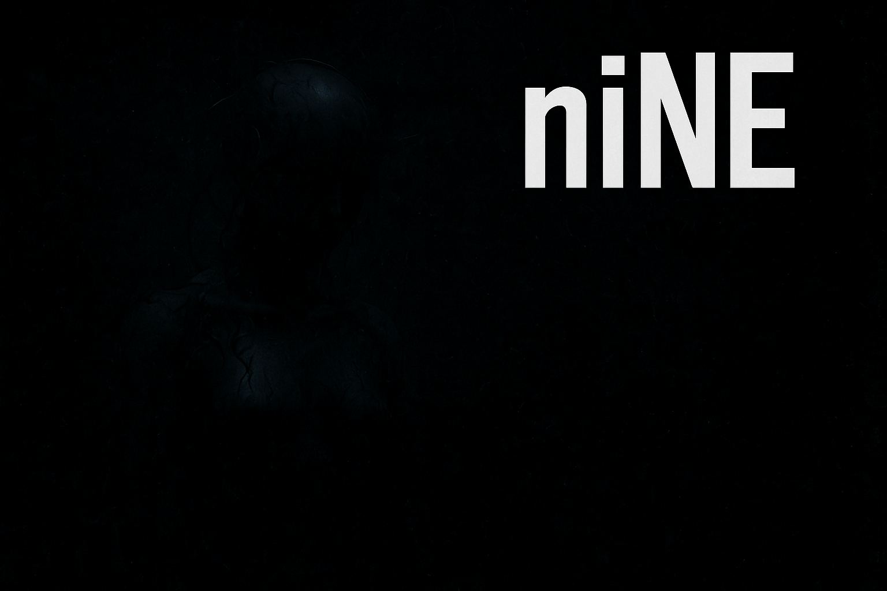

# niNE
Это упрощенный 3D фреймворк для ролевых игр, вдохновленный SS14 и Garry's Mod. Он позволяет игрокам легко создавать серверы и расширять функциональность с помощью Python-плагинов с поддержкой дополнительных ресурсов.




## Особенности

- **3D среда для ролевых игр**: Базовый 3D мир, в котором игроки могут подключаться и взаимодействовать
- **Простой хостинг серверов**: Запускайте серверы одним кликом или развертывайте отдельно
- **Расширенная система плагинов**: Поддержка плагинов как в виде файлов, так и папок с ресурсами
- **Сетевой мультиплеер**: Построен на asyncio и сокетах Python
- **Чат**: Внутриигровое текстовое общение

Для получения подробной технической информации, сведений об архитектуре и API для разработчиков, пожалуйста, обратитесь к нашей [**Технической документации (DOCS.md)**](DOCS.md).

## Установка

### Предварительные требования


- Python 3.12 или выше

```bash
pip install -r requirements.txt
```

### Быстрый старт

1. Клонируйте репозиторий:
```bash
git clone https://github.com/your-username/niNE.git
cd niNE
```

2. Установите зависимости:
```bash
pip install -r requirements.txt
```

3. **Сгенерируйте SSL-сертификаты**: Для безопасного соединения между клиентом и сервером вам потребуются SSL-сертификаты. В режиме разработки вы можете использовать самоподписанные:
```bash
mkdir certs
openssl req -x509 -newkey rsa:2048 -keyout certs/key.pem -out certs/cert.pem -days 365 -nodes -subj "/C=US/ST=CA/L=SanFrancisco/O=MyProject/OU=Dev/CN=localhost"
```

4. Запустите сервер:
```bash
python server.py
```

5. Запустите клиент:
```bash
python client.py
```

## Лицензия

Этот проект лицензирован под MIT License - подробности см. в файле [LICENSE](LICENSE).